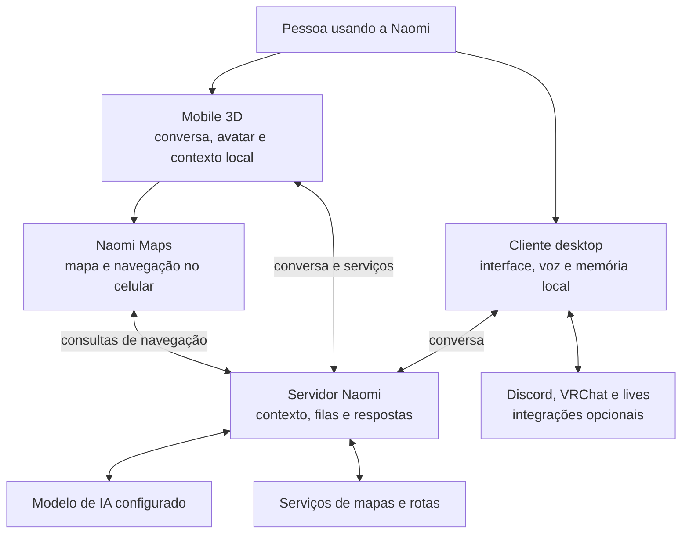

# Naomi AI

<p align="center">
  <strong>Uma assistente. Quatro partes conectadas: servidor, cliente desktop, Mobile 3D e Maps.</strong>
</p>

<p align="center">
  <a href="https://github.com/RyzenFox/naomi-ai-public/actions/workflows/public-demo.yml"></a>
  
  
  
</p>

<p align="center">
  <a href="https://naomi-ia.com">Site oficial</a> ·
  <a href="docs/arquitetura.md">Arquitetura</a> ·
  <a href="docs/servidor.md">Servidor</a> ·
  <a href="docs/cliente.md">Cliente</a> ·
  <a href="docs/mobile-3d.md">Mobile 3D</a> ·
  <a href="docs/naomi-maps.md">Maps</a>
</p>

## Conheça a Naomi

A **Naomi AI** é um projeto autoral de **RyzenFox** que conecta conversa, voz, memória, percepção visual e presença virtual. A proposta é dar continuidade à interação com uma assistente no computador, no celular e em ambientes como Discord, VRChat e lives.

Este repositório explica a engenharia do ecossistema em linguagem acessível. Os diagramas mostram responsabilidades e fluxos conceituais; a implementação completa permanece privada. A única aplicação executável aqui é uma **demo sintética**, sem acesso aos serviços reais da Naomi.

> **Atualização de setembro de 2026:** documentação dedicada ao servidor, ao cliente Windows, ao Naomi Mobile 3D e ao Naomi Maps, com limites de funcionamento e dependências de cada parte.

## Entenda em um minuto

| Parte | Em palavras simples | Papel técnico |
| --- | --- | --- |
| [**Naomi Servidor**](docs/servidor.md) | Organiza os pedidos e prepara as respostas. | Coordena contexto, acesso aos modelos, filas, respostas progressivas e serviços usados pelos clientes. |
| [**Naomi Cliente**](docs/cliente.md) | É a Naomi no computador do usuário. | Reúne interface, microfone, voz, memória local, percepção e integrações autorizadas. |
| [**Naomi Mobile 3D**](docs/mobile-3d.md) | Leva a interação para o celular, com uma presença 3D. | Combina cenas e avatar em Unity, conversa, áudio, contexto local e recursos do Android. |
| [**Naomi Maps**](docs/naomi-maps.md) | É a experiência de mapas e navegação integrada ao Mobile 3D. | Combina localização, busca de destinos, rotas, instruções por voz e dados de trânsito quando disponíveis. |

**Maps faz parte da experiência mobile.** Ele tem responsabilidades próprias, mas não é apresentado aqui como um aplicativo independente. O servidor pode atender vários clientes; o celular não é apenas um controle remoto do desktop.



O diagrama é conceitual: não representa endereços, máquinas, contratos de API ou implantação de produção. A renderização do mapa também pode carregar recursos do provedor no próprio celular.

## O que acontece quando você conversa

1. Você escreve ou fala em um cliente. A entrada por voz é convertida em texto pelo caminho disponível naquela plataforma.
2. O cliente reúne o contexto permitido para aquela interação e envia a solicitação ao servidor.
3. O servidor coordena o processamento, aplica os limites da fila e consulta o modelo ou serviço adequado.
4. O cliente apresenta a resposta e, quando configurado, produz voz e atualiza a expressão do avatar.
5. A persistência de contexto segue as regras do cliente e da conta. Conversa, memória durável e estado visual são responsabilidades diferentes.

Comandos locais e algumas funções de navegação têm caminhos próprios: nem toda ação precisa passar por um modelo de linguagem. Veja os [fluxos completos em alto nível](docs/arquitetura.md).

## Onde cada coisa acontece

| Ambiente | Responsabilidades | Dependências relevantes |
| --- | --- | --- |
| Computador do usuário | Interface desktop, dispositivos de áudio, memória local e integrações locais. | Hardware, permissões e configuração dos recursos ativados. |
| Ambiente do servidor | Orquestração, inferência e serviços compartilhados. | Capacidade de processamento, disponibilidade e provedores configurados. |
| Celular Android | Experiência 3D, interface, áudio, contexto local, GPS e apresentação do mapa. | Permissões, rede para funções conectadas e capacidade do aparelho. |
| Provedores externos | Recursos como voz neural, pesquisa e dados cartográficos, conforme a configuração. | Cobertura, conectividade e disponibilidade de cada serviço. |

**Local-first significa priorizar controle e armazenamento no dispositivo.** Não significa que todos os recursos funcionam sem internet. O servidor pode estar em outro computador; voz neural, buscas e mapas podem usar serviços externos. O contexto enviado para uma resposta continua sendo uma transferência de dados e deve respeitar a configuração de privacidade.

## Engenharia por trás da experiência

| Desafio | Como a arquitetura o aborda |
| --- | --- |
| Vários clientes pedindo respostas | Filas limitadas, controle de concorrência e cancelamento. |
| Conversa com continuidade | Separação entre histórico, memória e contexto enviado ao modelo. |
| Voz competindo com outras tarefas | Estados de áudio, roteamento e coordenação de interrupções. |
| PCs e celulares com capacidades diferentes | Perfis de qualidade, carregamento sob demanda e caminhos alternativos. |
| Interface 3D junto de um mapa interativo | Separação de renderização e cuidado com o ciclo de vida dos recursos. |
| Respostas de rede chegando fora de ordem | Controle de sessão, cancelamento e descarte de resultados antigos. |
| Integrações com serviços externos | Adaptadores com responsabilidades delimitadas e tratamento de indisponibilidade. |

Os mecanismos concretos e os parâmetros operacionais permanecem privados. A [matriz de capacidades](docs/modulos.md) ajuda a localizar cada responsabilidade.

## Tecnologias em alto nível

| Área | Tecnologias |
| --- | --- |
| Servidor e runtime | Python, FastAPI, HTTP/SSE e Ollama para modelos locais. |
| Cliente Windows | PySide6/QML, reconhecimento de voz com faster-whisper e síntese conforme configuração. |
| Memória e percepção | Persistência local, recuperação semântica e processamento visual supervisionado. |
| Mobile 3D | Unity 6, C#, URP e integração Android. |
| Maps | GPS do aparelho, Android WebView, JavaScript e Mapbox GL JS. |
| Presença e comunicação | OSC, Discord, VRChat e integrações para produção de lives. |
| Site | Next.js, TypeScript e React Three Fiber em um [repositório separado](https://github.com/RyzenFox/naomi-site). |

O modelo de IA é uma peça do sistema. Memória, persona, pesquisa, ferramentas, interface e coordenação são camadas distintas; este portfólio não afirma que a Naomi treina um modelo fundacional próprio.

## Estado do projeto

A Naomi está em **desenvolvimento ativo**. Esta documentação foi revisada em **17/09/2026** a partir dos componentes de desenvolvimento disponíveis. Uma capacidade documentada não garante que todas as versões distribuídas já a contenham ou que esteja habilitada em todos os dispositivos.

O foco móvel apresentado aqui é **Android**. Não há anúncio de versão iOS nesta documentação. Cobertura de trânsito, desempenho, sincronização e integrações variam por versão, região, hardware e configuração.

O badge de testes valida **somente a demo deste repositório**. Ele não certifica o cliente comercial, o servidor de produção ou um APK. Consulte o [roadmap](docs/roadmap.md) e o [histórico público](docs/changelog-publico.md).

## Navegue pela documentação

| Guia | O que explica |
| --- | --- |
| [Arquitetura](docs/arquitetura.md) | Estrutura lógica, fluxo de conversa e limites entre dados e componentes. |
| [Servidor](docs/servidor.md) | Orquestração, modelos, filas e resposta aos clientes. |
| [Cliente desktop](docs/cliente.md) | Interface, voz, memória, percepção e integrações do computador. |
| [Mobile 3D](docs/mobile-3d.md) | Experiência Unity/Android, contexto local e conexão com o ecossistema. |
| [Naomi Maps](docs/naomi-maps.md) | GPS, renderização, navegação, voz e dependências cartográficas. |
| [Capacidades](docs/modulos.md) | Responsabilidades por componente. |
| [Segurança e publicação](docs/seguranca.md) | O que é divulgado e o que permanece privado. |

## Demo pública

A demo apenas classifica entradas fictícias para ilustrar um fluxo simples. Não usa IA, rede, microfone, localização, banco de dados ou credenciais. Requer Python 3.11 ou superior; não é necessário instalar dependências externas.

```powershell
python .\src\app_naomi_public_demo.py
python -m unittest discover -s tests -v
```

```text
naomi-ai-public/
├── docs/                 # Guias conceituais do ecossistema
├── src/                  # Demo sintética independente
├── tests/                # Testes exclusivos da demo
├── .github/workflows/    # CI da demo pública
├── LICENSE
├── SECURITY.md
└── README.md
```

## Público e privado

Aqui são publicados explicações, diagramas conceituais, decisões de engenharia e a demo sintética. Código de produção, prompts completos, mecanismos comerciais, configuração de infraestrutura, dados de usuários, bancos de memória, credenciais, modelos e pacotes de distribuição ficam fora desta vitrine.

Projeto autoral de [**RyzenFox**](https://github.com/RyzenFox). [Site oficial](https://naomi-ia.com) · [Código do site](https://github.com/RyzenFox/naomi-site) · [Política de segurança](SECURITY.md).

Todos os direitos reservados, conforme a [licença](LICENSE). Repositório público para portfólio e demonstração técnica; a visibilidade pública não concede uma licença de código aberto.
