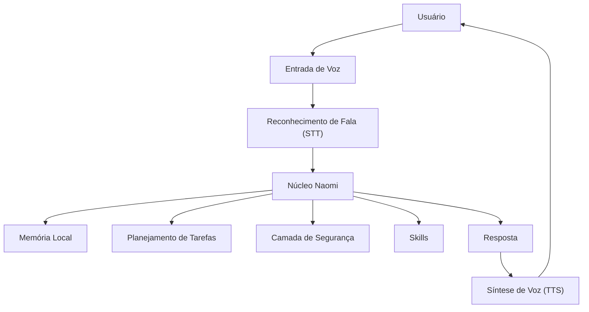

# Naomi AI — Assistente Local Modular para VRChat/VTuber

Projeto autoral de Inteligência Artificial local desenvolvido em Python, com foco em voz, memória, visão computacional, automação supervisionada e interação em ambientes virtuais como VRChat e fluxos VTuber.

## Visão geral

A Naomi AI é uma assistente de IA local modular criada para atuar como uma presença digital interativa em ambiente desktop, VRChat e VTuber.

O projeto combina:

- Reconhecimento e síntese de voz;
- Memória local;
- Automação supervisionada;
- Visão computacional;
- Integração com Discord;
- Controle por voz;
- Planejamento de tarefas;
- Arquitetura modular inspirada em sistemas multiagentes.

A ideia principal da Naomi é ir além de um chatbot comum. Ela foi projetada para perceber contexto, responder por voz, executar ações autorizadas e manter uma memória local do usuário e das interações.

## Status do projeto

Projeto em desenvolvimento ativo.

Atualmente, a Naomi possui módulos funcionais para:

- Interface desktop;
- TTS/STT com Azure Speech;
- Memória local com SQLite;
- Integração com YOLO/OpenCV;
- Discord Bridge;
- Planejamento e execução de tarefas;
- Sistema de skills;
- Biometria/identidade de voz experimental;
- Controle de interrupção de fala;
- Organização modular com Git/GitHub.

## Objetivo do projeto

O objetivo da Naomi é estudar e desenvolver uma arquitetura prática de IA local aplicada, unindo conceitos de:

- Desenvolvimento de software;
- Inteligência Artificial;
- Automação;
- Interação humano-computador;
- Segurança de execução;
- Sistemas modulares;
- Assistentes virtuais personalizados;
- Integração com ambientes virtuais.

Este projeto também serve como portfólio técnico para demonstrar conhecimentos em Python, IA aplicada, automação, visão computacional, backend local e arquitetura de sistemas.

## Principais funcionalidades

### Voz e conversação

- Reconhecimento de fala em português.
- Resposta com voz sintetizada.
- Wake words para ativação.
- Interrupção controlada da fala.
- Controle de fluxo para evitar que a IA responda a áudio indevido.

### Memória local

- Registro local de interações.
- Memória separada por contexto.
- Módulos de reflexão e feedback.
- Armazenamento local usando SQLite e arquivos internos.

### Visão computacional

- Integração com YOLO/OpenCV.
- Rastreamento visual experimental.
- Uso voltado para interação em ambientes virtuais.

### Automação supervisionada

- Abertura de sites.
- Busca no Google/YouTube.
- Integração com Discord.
- Envio supervisionado de mensagens.
- Bloqueio de ações sensíveis ou perigosas.

### Arquitetura modular

A Naomi é dividida em módulos independentes para facilitar manutenção, testes e evolução.

## Arquitetura geral

Fluxo simplificado de funcionamento:



## Stack utilizada

| Área | Tecnologias |
| --- | --- |
| Linguagem principal | Python |
| Interface | CustomTkinter |
| Voz | Azure Cognitive Services Speech |
| IA local / LLM | Ollama |
| Backend / servidor | FastAPI |
| Memória local | SQLite |
| Visão computacional | YOLO, OpenCV, MSS |
| Áudio | sounddevice, VAD |
| Automação | PyAutoGUI, PyDirectInput |
| Integrações | Discord, OSC, VRChat/Warudo |
| Versionamento | Git, GitHub |
| IA / ML | PyTorch, Ultralytics |

## Estrutura principal do projeto

```text
naomi-ai/
│
├── app_naomi.py
├── requirements.txt
├── .env.example
├── README.md
│
├── naomi_core/
│   ├── actions/
│   ├── cognition/
│   ├── core/
│   └── memory/
│
├── naomi_athena_alias/
├── naomi_athena_semantic/
├── naomi_metis_feedback/
├── naomi_metis_reflection/
│
├── naomi_task_planner/
├── naomi_plan_executor/
├── naomi_execution_reporter/
│
├── naomi_skill_library/
├── naomi_skill_router/
├── naomi_skill_memory/
├── naomi_skill_optimizer/
│
├── naomi_barge_in_guard/
├── naomi_voice_input_gate/
├── naomi_audio_input_mute/
│
├── naomi_speaker_identity/
├── naomi_speaker_identity_pro/
│
├── naomi_discord_bridge/
├── servidor/
├── scripts/
└── testes/
```

## Explicação dos módulos principais

**`app_naomi.py`**
Arquivo principal da aplicação desktop. Ele concentra a interface, inicialização dos módulos, controle de áudio, fluxo de voz, integração com o servidor e chamadas principais da Naomi.

**`naomi_core/`**
Base estrutural da Naomi. Contém componentes de configuração, estado interno, ações, cognição e memória.

**`naomi_task_planner/`**
Responsável por analisar comandos e transformar intenções em planos ou etapas executáveis.

**`naomi_plan_executor/`**
Executa planos supervisionados, controlando ações que podem ou não exigir confirmação.

**`naomi_skill_library/`**
Biblioteca de habilidades disponíveis para a Naomi. Ajuda a organizar capacidades reutilizáveis.

**`naomi_skill_router/`**
Roteia comandos para a habilidade mais adequada, evitando que tudo fique centralizado em um único arquivo.

**`naomi_skill_memory/`**
Guarda estatísticas e telemetria de uso das habilidades.

**`naomi_skill_optimizer/`**
Sugere melhorias com base em falhas, uso e desempenho das skills.

**`naomi_athena_*`**
Camadas relacionadas à memória, aliases, semântica e recuperação de contexto.

**`naomi_metis_*`**
Módulos de reflexão, feedback e aprendizado local a partir das interações.

**`naomi_barge_in_guard/`**
Controla interrupções de fala, evitando que qualquer ruído ou voz externa corte a Naomi indevidamente.

**`naomi_voice_input_gate/`**
Filtra entradas de voz externas, especialmente em cenários com áudio vindo de ambientes virtuais.

**`naomi_speaker_identity/` e `naomi_speaker_identity_pro/`**
Módulos experimentais para identificação/validação de voz.

**`naomi_discord_bridge/`**
Integração com Discord para envio e monitoramento de mensagens de forma controlada.

**`servidor/`**
Componentes do servidor local e experimentos de backend.

**`scripts/`**
Scripts auxiliares para inicialização e execução do projeto.

**`testes/`**
Testes e validações locais.

## Segurança e privacidade

Este repositório foi preparado para evitar o versionamento de arquivos sensíveis.

Arquivos ignorados pelo Git incluem:

- `.env`
- Bancos locais `.db`
- Memórias locais
- Áudios pessoais
- Modelos pesados
- Backups antigos
- Ambientes virtuais
- Caches
- Tokens e credenciais

O arquivo `.env.example` é fornecido apenas como modelo de configuração.

## Configuração local

### 1. Clonar o repositório

```bash
git clone https://github.com/RyzenFox/naomi-ai-public.git
cd naomi-ai-public
```

### 2. Criar ambiente virtual

```bash
python -m venv .venv
```

No Windows:

```bash
.venv\Scripts\activate
```

### 3. Instalar dependências

```bash
pip install -r requirements.txt
```

### 4. Configurar variáveis de ambiente

Crie um arquivo `.env` com base no `.env.example`.

Exemplo:

```env
AZURE_KEY=sua_chave_aqui
AZURE_REGION=brazilsouth
URL_SERVIDOR=http://127.0.0.1:8000
DISCORD_BOT_TOKEN=seu_token_aqui
LOGIN_USER=seu_usuario
LOGIN_SENHA=sua_senha
```

### 5. Executar

```bash
python app_naomi.py
```

## Exemplo de variáveis no `.env.example`

```env
AZURE_KEY=coloque_sua_chave_aqui
AZURE_REGION=brazilsouth
URL_SERVIDOR=http://127.0.0.1:8000
API_SECRET_KEY=coloque_uma_chave_local_aqui
LOGIN_USER=coloque_seu_usuario_aqui
LOGIN_SENHA=coloque_sua_senha_aqui
DISCORD_BOT_TOKEN=coloque_o_token_aqui
NAOMI_WHATSAPP_NUMBER=5511999999999
```

## Roadmap

### Concluído / em funcionamento

- Interface desktop com CustomTkinter.
- Integração com Azure Speech.
- Memória local.
- Discord Bridge.
- Organização modular.
- Git/GitHub.
- Planner, executor e sistema de skills.
- Filtros de segurança para automações.

### Em evolução

- Melhor separação entre cliente e servidor.
- Refinamento da arquitetura multiagente.
- Melhor documentação interna.
- Testes automatizados.
- Refatoração dos módulos antigos.
- Interface mais profissional.
- Sistema de plugins.
- Dashboard de telemetria.
- Melhor experiência de instalação.

### Futuro

- Versão pública demonstrativa.
- Instalador simplificado.
- Integração com mais plataformas.
- Assistente com perfis de personalidade.
- Memória semântica mais robusta.
- Controle avançado de permissões.
- Modo portfólio/demo sem dados privados.

## Principais aprendizados do projeto

Durante o desenvolvimento da Naomi foram explorados conceitos como:

- Arquitetura modular em Python;
- Integração entre IA e aplicações desktop;
- Automação supervisionada;
- Controle de fluxo por voz;
- Segurança em ações automatizadas;
- Versionamento com Git;
- Organização de projeto para portfólio;
- Separação de dados sensíveis;
- Uso de IA em ambientes virtuais;
- Testes locais e depuração contínua.

## Autor

**Gabriel Fernandes Couto**
Estudante de Ciência da Computação
Foco em Python, Inteligência Artificial, automação e segurança cibernética.

- GitHub: https://github.com/RyzenFox
- LinkedIn: https://www.linkedin.com/in/gabriel-couto-50199a3a2

## Observação

Este projeto está em desenvolvimento e representa um laboratório autoral de IA aplicada. Algumas partes ainda estão em fase experimental, sendo continuamente refatoradas e melhoradas.
