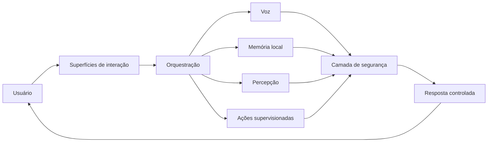

# Naomi AI — Portfólio Público

> Vitrine técnica e documentação de alto nível. A implementação de produção da Naomi permanece privada.


## Sobre o projeto

Naomi AI é uma assistente multimodal autoral criada para explorar engenharia de software aplicada a IA, interação por voz, memória local, percepção visual e integração controlada com experiências desktop, mobile e VTuber.

O projeto funciona como laboratório técnico e portfólio. Seu desenvolvimento prioriza modularidade, estabilidade, privacidade local, testes de regressão e limites claros entre recursos demonstráveis e componentes proprietários.

## Estado atual — junho de 2026

Em alto nível, a Naomi já trabalha com:

- interação desktop por voz e interface gráfica;
- memória local e recuperação contextual;
- percepção visual e consciência de tela supervisionadas;
- integração com ambientes virtuais e produção de live;
- cliente, servidor e experiência mobile coordenados;
- perfis de desempenho com degradação segura para diferentes hardwares;
- atualização do cliente com preservação de dados locais;
- controles de autorização, privacidade e isolamento de contas;
- testes automatizados para fluxos críticos.

Esta lista descreve capacidades, não a implementação. Protocolos privados, regras internas, prompts, credenciais, modelos, rotas de produção e código comercial não são publicados.

## Arquitetura conceitual



O diagrama é deliberadamente abstrato. Ele comunica responsabilidades arquiteturais sem revelar nomes internos, topologia de produção ou mecanismos de proteção.

## Competências demonstradas

| Área | Evidência de engenharia |
| --- | --- |
| Python | Organização modular, concorrência, filas e testes |
| Backend | APIs, streaming, isolamento de sessões e observabilidade |
| Interface | Desktop, QML e fluxos orientados a eventos |
| IA aplicada | Voz, percepção, memória contextual e modelos locais |
| Mobile | Integração Android/Unity e comunicação autenticada |
| Confiabilidade | Fallbacks de hardware, diagnósticos e testes de regressão |
| Segurança | Segregação de dados, autorização e publicação sanitizada |
| DevOps | Git, revisão por Pull Request e empacotamento Windows |

## O que este repositório contém

- documentação pública de arquitetura;
- mapa conceitual de capacidades;
- roadmap público;
- política de segurança e de publicação;
- uma demo sintética, independente e sem integrações reais;
- testes da demo pública.

## O que permanece privado

- código de produção do cliente e do servidor;
- autenticação, licenciamento e mecanismos antifraude;
- prompts, persona, regras comportamentais e memória real;
- bancos, áudios, modelos, telemetria e dados de usuários;
- endpoints, domínios, chaves e arquivos de configuração;
- scripts de build, atualização e distribuição comercial;
- integrações completas com plataformas externas.

Consulte [Segurança e publicação](docs/seguranca.md) para a política completa desta vitrine.

## Demo pública

A demo não usa rede, modelos, microfone, banco de dados ou credenciais. Ela existe somente para demonstrar organização básica de código.

```powershell
python .\src\app_naomi_public_demo.py
python -m unittest discover -s tests -v
```

Ela não é uma versão reduzida do núcleo real e não deve ser interpretada como documentação do comportamento de produção.

## Estrutura pública

```text
naomi-ai-public/
├── docs/
│   ├── arquitetura.md
│   ├── modulos.md
│   ├── roadmap.md
│   └── seguranca.md
├── src/
│   └── app_naomi_public_demo.py
├── tests/
│   └── test_public_demo.py
├── LICENSE
├── SECURITY.md
└── README.md
```

## Documentação

- [Arquitetura pública](docs/arquitetura.md)
- [Capacidades conceituais](docs/modulos.md)
- [Roadmap público](docs/roadmap.md)
- [Segurança e publicação](docs/seguranca.md)
- [Histórico público](docs/changelog-publico.md)

## Autor

Projeto autoral de **RyzenFox**.

- [Perfil no GitHub](https://github.com/RyzenFox)

## Licença

Todos os direitos reservados. O conteúdo é disponibilizado para portfólio e demonstração técnica. Consulte [LICENSE](LICENSE).
