# Naomi AI — Assistente Multimodal Local

<p align="center">
  <strong>Voz, memória, percepção, automação supervisionada e presença virtual em uma arquitetura local-first.</strong>
</p>

<p align="center">
  <a href="https://github.com/RyzenFox/naomi-ai-public/actions/workflows/public-demo.yml"></a>
  
  
  
  
</p>

<p align="center">
  <a href="#visão-geral">Visão geral</a> •
  <a href="#como-a-naomi-funciona">Como funciona</a> •
  <a href="#fluxo-de-voz-real">Voz</a> •
  <a href="#memória-e-contexto">Memória</a> •
  <a href="#mobile-e-ponte-com-o-pc">Mobile</a> •
  <a href="#live-e-presença-virtual">Live</a> •
  <a href="#site-oficial-e-ecossistema-público">Site</a> •
  <a href="#evolução-recente">Evolução</a> •
  <a href="#segurança-e-privacidade">Segurança</a>
</p>

> [!IMPORTANT]
> Este README descreve o funcionamento real da Naomi em nível arquitetural, com base no Git privado do projeto. Código de produção, endpoints, prompts, credenciais, regras internas, modelos e mecanismos comerciais permanecem privados.

## Visão geral

A Naomi AI é uma assistente autoral construída para existir em várias superfícies ao mesmo tempo: desktop, voz, mobile, Discord, VRChat, Warudo e produção de live. Ela não é apenas uma janela de chat. O sistema coordena áudio, memória, modelos locais, percepção visual, filas de trabalho, ações supervisionadas e estado de avatar.

O princípio central é **local-first**:

- voz e memória podem permanecer no PC do usuário;
- recursos pesados são carregados sob demanda;
- integrações externas são isoladas por adaptadores;
- o servidor organiza concorrência e streaming sem possuir o cofre privado do PC;
- o mobile funciona diretamente com o servidor e usa a ponte do PC somente quando ela está disponível e autorizada;
- falhas de GPU, rede ou serviços externos ativam caminhos de degradação segura.

### Snapshot técnico do Git privado

<details>
<summary><strong>Ver escala do projeto em 30/07/2026</strong></summary>

| Indicador | Quantidade rastreada |
| --- | ---: |
| Arquivos Python (cliente, servidor, auth, instalador) | 432 |
| Arquivos de teste dedicados | 161 |
| Scripts PowerShell | 27 |
| Launchers e scripts Batch | 14 |
| Superfícies QML | 10 |
| Arquivos Kotlin (Android) | 13 |
| Documentos Markdown | 70 |

Os números representam um snapshot do commit privado usado para esta documentação e mudam conforme o projeto evolui.

</details>

## Como a Naomi funciona

### Mapa do sistema

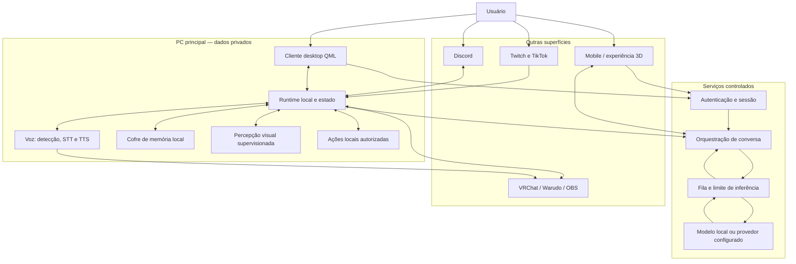

### Responsabilidade de cada camada

| Camada | Responsabilidade real | Se ficar indisponível |
| --- | --- | --- |
| Cliente QML | Login, configurações, logs, controle do runtime e experiência visual | O servidor continua isolado; a interface pode ser reiniciada |
| Runtime local | Microfone, voz, estado, ações, integrações e eventos | Recursos locais param sem corromper o servidor |
| Cofre de memória | Histórico recente, fatos e recuperação semântica por usuário | A conversa continua sem contexto privado |
| Servidor | Montagem de contexto, políticas, filas e streaming de resposta | Cliente entra em estado de erro recuperável |
| Gate de inferência | Limita concorrência, fila requisições e permite cancelamento | Evita sobrecarga de CPU, RAM e VRAM |
| Mobile | Conversa, comandos, mídia, mapas e presença 3D | Continua direto no servidor, mesmo sem ponte privada do PC |
| Live host | Classifica eventos e decide quando responder | A live continua sem automação da Naomi |
| Avatar/OSC | Expressões, estados e presença em ambientes virtuais | Voz e conversa continuam funcionando |

## Fluxo de voz real

A voz percorre um pipeline com dois caminhos: comandos rápidos e determinísticos ficam no PC; conversa aberta segue para a orquestração e o modelo.

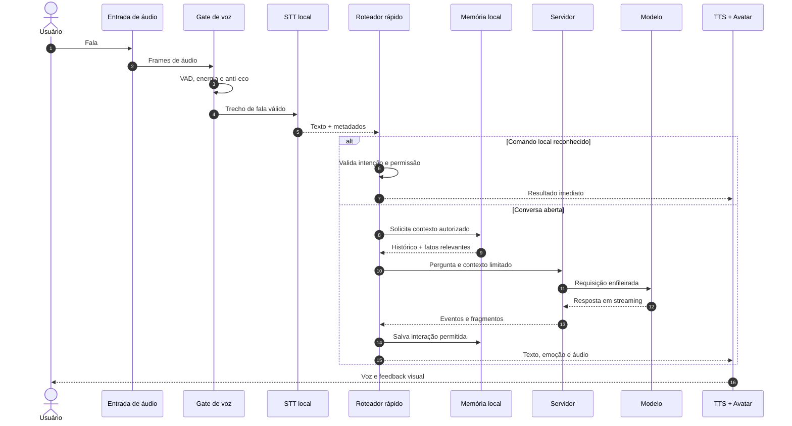

### Estados do runtime de voz

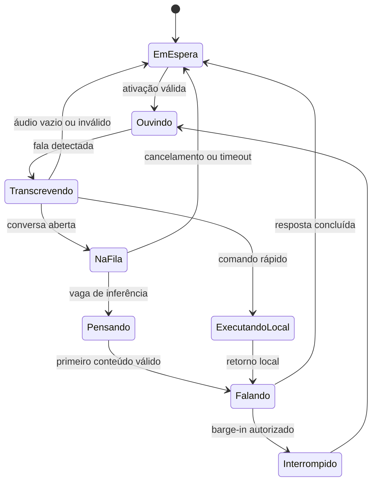

### Tecnologias de voz

- **STT principal:** reconhecimento local com `faster-whisper`;
- **detecção de fala:** VAD com fallback por energia/RMS;
- **TTS:** voz neural quando configurada, com fallback local do Windows;
- **interrupção:** barge-in controlado para evitar que ruído ou áudio virtual interrompam a Naomi;
- **roteamento:** microfone, Discord e cabos virtuais mantêm caminhos separados para reduzir feedback.

## Memória e contexto

A memória é separada da geração de texto. O modelo recebe somente um recorte necessário para a resposta atual.

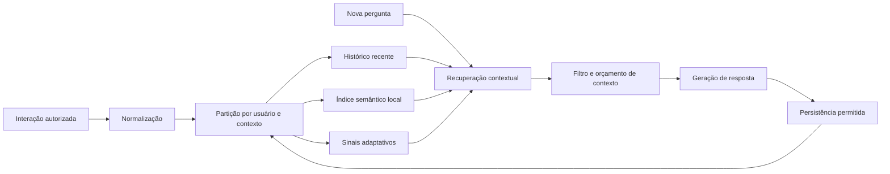

Na implementação real:

- a memória principal vive no PC do usuário;
- histórico recente e memória semântica são combinados;
- existe fallback local quando o backend semântico opcional não está disponível;
- perfis e fatos são isolados por identidade/contexto;
- o servidor pode solicitar um snapshot temporário pela ponte autorizada;
- o servidor não transforma a memória privada do PC em um banco público central.

## Mobile e ponte com o PC

O mobile é um cliente autenticado direto do servidor. A presença do PC acrescenta recursos privados, mas não é condição para a conversa básica.

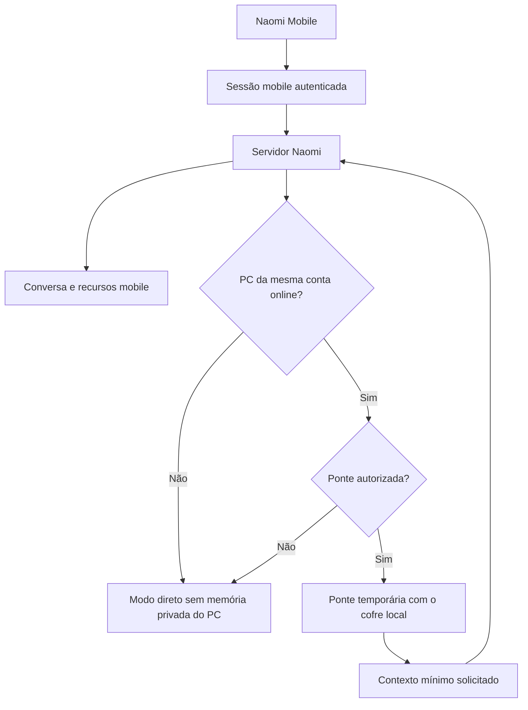

### Capacidades mobile em alto nível

- login separado para dispositivo mobile;
- conversa por texto ou áudio;
- resposta com emoção e voz;
- ações de mídia e abertura de aplicativos;
- navegação e mapas;
- experiência 3D com avatar;
- check-ins e notificações supervisionadas;
- sincronização opcional com o PC da mesma conta.

## Servidor, fila e streaming

O servidor usa uma fila limitada para impedir que vários clientes iniciem inferências pesadas ao mesmo tempo.

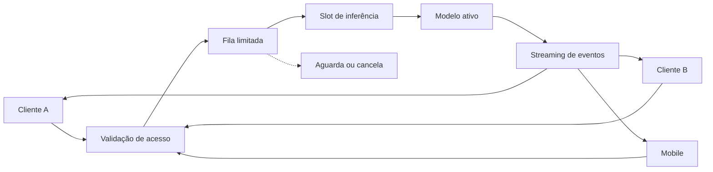

Esse desenho permite:

- concorrência configurável;
- limite de fila e timeout;
- cancelamento cooperativo;
- métricas de ocupação;
- resposta progressiva em vez de esperar o texto inteiro;
- troca controlada do modelo ativo sem manter vários modelos pesados na VRAM.

## Perfis de desempenho e modo jogo

A Naomi detecta o hardware e aplica limites seguros antes de iniciar os módulos pesados.

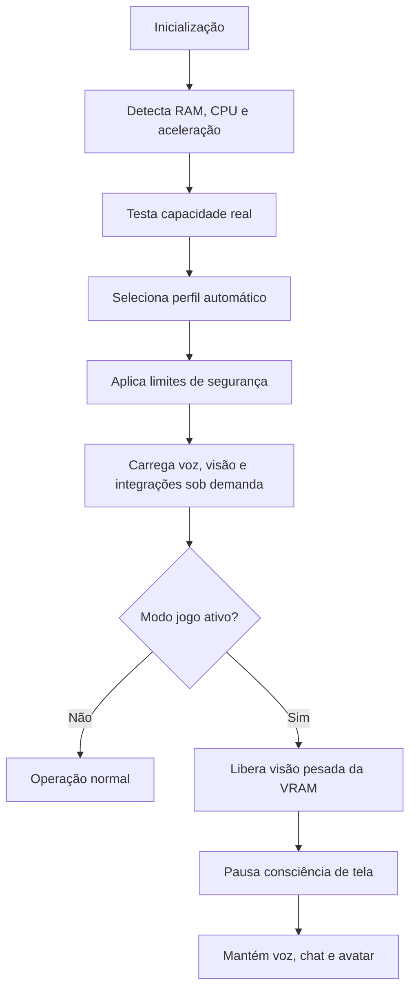

Os perfis cobrem desde PCs modestos até máquinas fortes. Uma GPU só é usada quando uma operação real confirma compatibilidade; caso contrário, voz e percepção descem para um caminho seguro de CPU.

## Live e presença virtual

Mensagens de plataformas diferentes viram eventos normalizados antes de chegar ao host de live.

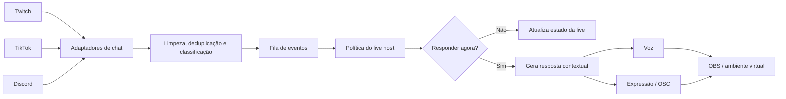

O host controla ritmo, prioridade, repetição, eventos sociais e momentos de silêncio. Assim, cada mensagem não vira automaticamente uma fala e a Naomi não monopoliza a transmissão.

## Site oficial e ecossistema público

A Naomi tem um site oficial no ar — **[naomi-ia.com](https://naomi-ia.com)** — e ele não é uma vitrine estática: o chat da home conversa com a Naomi real. As mensagens dos visitantes chegam ao PC do criador por um túnel seguro, passam pelas mesmas políticas de fila e cota, e voltam com a resposta da própria IA.

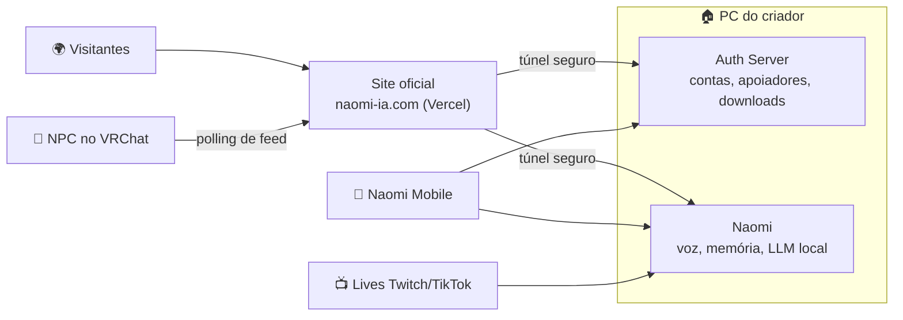

O código do site é um projeto separado e público, com README próprio e diagramas:

| Repositório | Conteúdo |
| --- | --- |
| [naomi-site](https://github.com/RyzenFox/naomi-site) | Site oficial: Next.js 16, avatar 3D, chat ao vivo, estúdio de mídia, área de apoiadores |
| **naomi-ai-public** (este) | Arquitetura da assistente em si, documentada a partir do Git privado |

## Evolução recente

Marcos de junho e julho de 2026, em ordem aproximada:

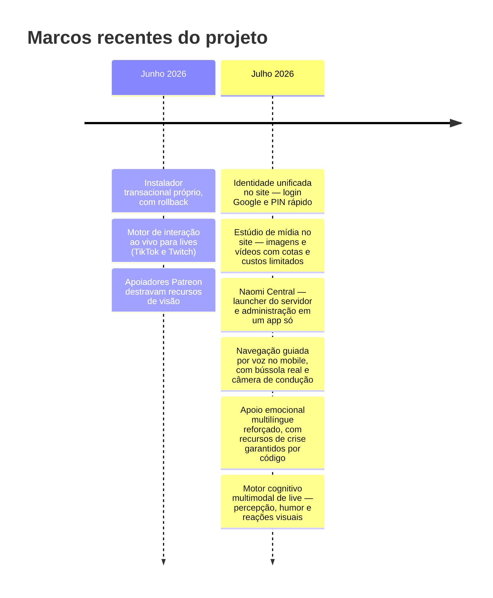

Cada marco corresponde a commits reais no Git privado; os detalhes de implementação permanecem fora do repositório público.

## Segurança e privacidade

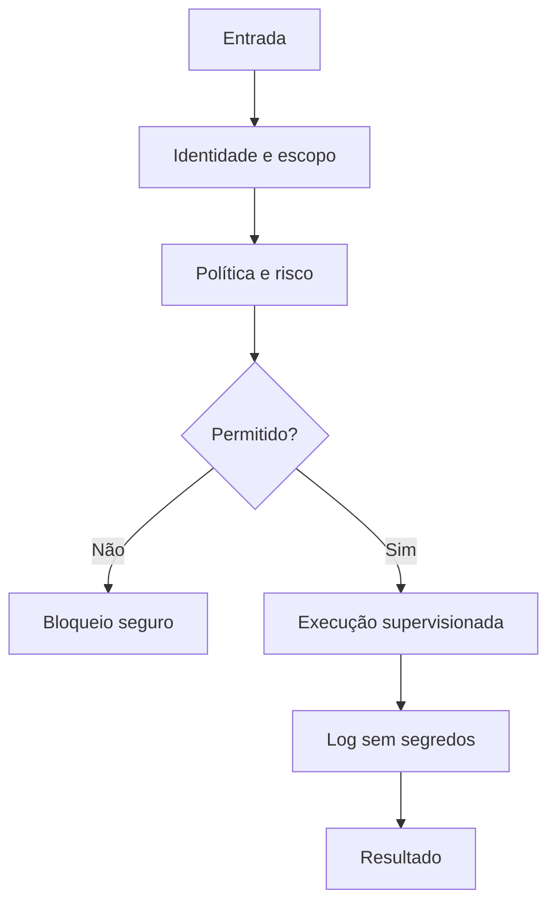

| Proteção | Como o projeto trata |
| --- | --- |
| Credenciais | Permanecem fora do Git e não entram em logs normais |
| Sessões | São separadas por tipo de cliente e escopo de conta |
| Memória | Fica local por padrão e só cruza a ponte quando autorizada |
| Ações | Passam por classificação, permissão e confirmação conforme o risco |
| Integrações | Usam adaptadores isolados e podem ser desligadas individualmente |
| Publicação | O repositório público contém somente documentação e demo sintética |
| Persona | Regras completas, prompts e mecanismos de proteção permanecem privados |

Mais detalhes sobre o limite de publicação estão em [docs/seguranca.md](docs/seguranca.md).

## Matriz de recursos

| Recurso | Desktop | Servidor | Mobile | Live/Virtual |
| --- | :---: | :---: | :---: | :---: |
| Conversa em streaming | ✅ | ✅ | ✅ | ✅ |
| STT local | ✅ | ◐ | ✅ | ✅ |
| TTS com fallback | ✅ | ✅ | ✅ | ✅ |
| Memória privada | ✅ | Ponte temporária | Ponte opcional | Contexto controlado |
| Percepção visual | ✅ | — | ◐ | ✅ |
| Ações supervisionadas | ✅ | Políticas | ✅ | Adaptadores |
| Estado de avatar / OSC | ✅ | Eventos | ✅ | ✅ |
| Perfis de hardware | ✅ | Limites de modelo | ◐ | ✅ |
| Isolamento por conta | ✅ | ✅ | ✅ | ✅ |

`◐` indica que a capacidade depende da plataforma, configuração ou ponte disponível.

## Stack real em alto nível

| Domínio | Tecnologias utilizadas |
| --- | --- |
| Linguagem e runtime | Python, PowerShell, Kotlin |
| Interface desktop | PySide6/QML e componentes desktop legados |
| Backend | FastAPI, streaming HTTP/SSE e filas limitadas |
| Modelos locais | Ollama e backends configuráveis |
| Voz | faster-whisper, VAD, Azure TTS e fallback do Windows |
| Memória | SQLite, recuperação semântica e backend vetorial opcional |
| Visão | OpenCV, captura de tela e modelos YOLO |
| Mobile | Android e Unity |
| Presença virtual | OSC, VRChat, Warudo e OBS |
| Comunidades/live | Discord, Twitch e TikTok |
| Qualidade | pytest/unittest, testes de integração e carregamento QML offscreen |

## Estratégia de fallback

| Falha detectada | Comportamento esperado |
| --- | --- |
| GPU incompatível com o runtime | Usa CPU e reduz modelos pesados |
| VAD externo falha | Ativa detecção de energia/RMS |
| TTS neural indisponível | Usa voz local quando possível |
| Ponte de memória offline | Responde sem memória privada do PC |
| Modelo ocupado | Entra em fila limitada ou permite cancelamento |
| Visão pesada durante jogo | Libera VRAM e mantém voz/chat |
| Plataforma de live desconectada | Desliga apenas o adaptador afetado |
| Interface reiniciada | Reconstrói o estado sem expor segredos |

## Demo pública e testes

A demo deste repositório é propositalmente sintética: não acessa rede, microfone, banco de dados, modelo ou credenciais.

```powershell
python .\src\app_naomi_public_demo.py
python -m unittest discover -s tests -v
```

O workflow público executa compilação e testes a cada Pull Request e atualização da `main`, alimentando o badge no topo deste README.

## Estrutura deste repositório

```text
naomi-ai-public/
├── .github/workflows/       # CI exclusivo da demo pública
├── docs/                    # arquitetura e política de publicação
├── src/                     # demo sintética, sem código de produção
├── tests/                   # testes da demo pública
├── LICENSE
├── SECURITY.md
└── README.md
```

## Público x privado

| Publicado | Mantido privado |
| --- | --- |
| Diagramas arquiteturais | Código do cliente e servidor |
| Fluxos comportamentais de alto nível | Endpoints e topologia de produção |
| Demo sintética | Autenticação e licenciamento |
| Testes da demo | Prompts, persona e regras internas |
| Decisões de engenharia | Bancos, memórias, áudios e modelos |
| Roadmap público | Builds, instaladores e distribuição comercial |

## Perguntas frequentes

<details>
<summary><strong>Este repositório executa a Naomi completa?</strong></summary>

Não. Ele apresenta a arquitetura real em alto nível e oferece somente uma demo sintética para portfólio.

</details>

<details>
<summary><strong>A Naomi depende sempre de internet?</strong></summary>

Não. Voz, memória e modelos podem operar localmente. Serviços externos são opcionais ou específicos de determinadas integrações.

</details>

<details>
<summary><strong>O celular precisa do PC ligado?</strong></summary>

Não para a conversa direta com o servidor. O PC é necessário apenas quando o usuário deseja recursos privados hospedados localmente, como a ponte de memória.

</details>

<details>
<summary><strong>Por que o código completo não é público?</strong></summary>

O projeto contém identidade autoral, dados sensíveis, mecanismos comerciais e integrações privadas. A documentação pública demonstra engenharia sem distribuir esses componentes.

</details>

## Documentação adicional

- [Arquitetura pública](docs/arquitetura.md)
- [Capacidades conceituais](docs/modulos.md)
- [Roadmap público](docs/roadmap.md)
- [Segurança e publicação](docs/seguranca.md)
- [Histórico público](docs/changelog-publico.md)

## Autor e licença

Projeto autoral de **RyzenFox**.

- [Perfil no GitHub](https://github.com/RyzenFox)
- Conteúdo protegido por [LICENSE](LICENSE)

Todos os direitos reservados. A documentação é disponibilizada para portfólio e demonstração técnica.
