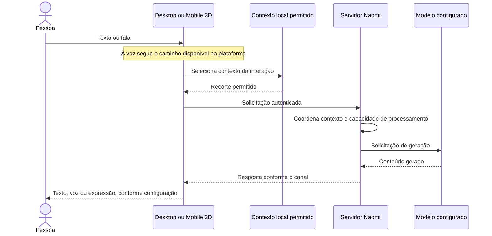

# Como o ecossistema Naomi se organiza

[Início](../README.md) · [Servidor](servidor.md) · [Cliente](cliente.md) · [Mobile 3D](mobile-3d.md) · [Maps](naomi-maps.md)

A arquitetura separa **a experiência do usuário**, **a coordenação das tarefas** e **os serviços que executam cada capacidade**. Desktop e celular têm responsabilidades locais; o servidor coordena os recursos compartilhados. O Maps é uma experiência especializada dentro do Mobile 3D.

## Estrutura lógica

Esta árvore é um mapa de responsabilidades, não a árvore de arquivos do código privado.

```text
Naomi AI
├── Experiências
│   ├── Cliente desktop: interface, áudio e recursos do PC
│   ├── Mobile 3D: conversa, avatar e recursos Android
│   │   └── Maps: localização, mapa e navegação
│   └── Site e canais de interação
├── Coordenação
│   ├── Estado e eventos de cada cliente
│   ├── Orquestração de conversa no servidor
│   └── Filas, prioridade e cancelamento
├── Capacidades
│   ├── Modelos de linguagem e percepção
│   ├── Voz: reconhecimento e síntese
│   ├── Histórico, memória e recuperação de contexto
│   ├── Pesquisa e ferramentas supervisionadas
│   └── Busca geográfica, rotas e dados cartográficos
└── Camadas transversais
    ├── Identidade, autorização e privacidade
    ├── Integrações com plataformas externas
    └── Diagnóstico, qualidade e distribuição
```

## Fluxo conceitual de conversa



Streaming HTTP/SSE permite resposta progressiva nos canais que o utilizam. Outros fluxos retornam uma resposta completa ou áudio. Comandos locais, apresentação do avatar e instruções de navegação não precisam seguir exatamente esse percurso.

## O que cada camada acrescenta

| Camada | Função | Por que é separada |
| --- | --- | --- |
| Modelo | Gera texto ou interpreta entradas compatíveis. | Pode mudar sem substituir toda a interface. |
| Persona | Orienta a forma de interação. | Identidade e comportamento não se resumem ao modelo escolhido. |
| Memória | Persiste e recupera contexto permitido. | O histórico não precisa ser enviado integralmente a cada pergunta. |
| Pesquisa | Consulta informação externa quando o recurso está disponível. | Conhecimento do modelo e informação atual têm origens diferentes. |
| Ferramentas | Executam capacidades delimitadas. | Produzir uma resposta não equivale a autorizar uma ação. |
| Orquestração | Coordena estado, filas, cancelamento e resultados. | Evita que cada integração controle o sistema inteiro. |
| Apresentação | Mostra texto, voz, avatar e mapas. | Cada dispositivo tem suas próprias restrições e interface. |

Os prompts, critérios internos, formatos de mensagem e algoritmos de produção não são publicados.

## Dados e continuidade

| Tipo de estado | Papel no sistema | Limite importante |
| --- | --- | --- |
| Histórico da conversa | Mantém continuidade recente. | Não é o mesmo que memória semântica durável. |
| Memória desktop | Permite contexto e recuperação no PC. | Disponibilidade e uso dependem da configuração e das regras de acesso. |
| Contexto mobile | Mantém continuidade no aparelho e fornece um recorte à conversa. | Não implica executar no celular o mesmo mecanismo semântico do desktop. |
| Ponte entre dispositivos | Acrescenta continuidade entre recursos da mesma conta. | Requer disponibilidade e autorização; não é acesso público à memória. |
| Estado de navegação | Mantém destino, rota, progresso e apresentação do mapa. | Não deve ser confundido com memória de conversa. |
| Estado de avatar | Representa expressão e presença visual. | Não determina sozinho a inteligência ou a resposta. |

Local-first descreve uma prioridade de arquitetura. Uma solicitação enviada a um servidor remoto ou provedor externo sai do dispositivo; o armazenamento local não elimina essa dependência.

## Falhas e fronteiras

| Situação | Responsabilidade da arquitetura |
| --- | --- |
| Modelo ocupado | Limitar fila, informar espera e permitir encerramento da solicitação. |
| Serviço externo indisponível | Apresentar indisponibilidade ou alternativa compatível com o recurso. |
| Ponte com o PC indisponível | Não inventar contexto privado; a conversa mobile direta pode seguir sem essa ponte. |
| GPS impreciso | Tratar a qualidade da localização antes de atualizar a navegação. |
| Resposta antiga de rede | Evitar aplicar um resultado a uma sessão ou destino que já mudou. |
| Mapa fechado ou aplicativo suspenso | Gerenciar os recursos e restaurar o estado compatível ao retornar. |

Essas são responsabilidades e estratégias presentes no projeto, não uma garantia de recuperação universal. O comportamento distribuído depende da versão e precisa ser verificado em cada plataforma.

## Limite da documentação

Este material descreve o projeto em desenvolvimento em alto nível. Não publica endereços internos, topologia operacional, contratos de produção, esquemas de bancos, parâmetros de proteção ou instruções de implantação. Veja a [política de publicação](seguranca.md).
