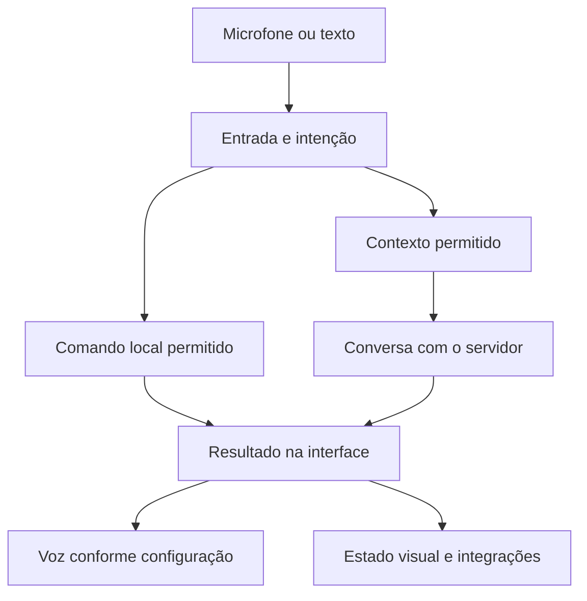

# Naomi Cliente — desktop

[Início](../README.md) · [Arquitetura](arquitetura.md) · [Servidor](servidor.md) · [Mobile 3D](mobile-3d.md) · [Maps](naomi-maps.md)

O cliente é a aplicação que coloca a Naomi **no computador do usuário**. Ele integra a interface com os dispositivos de áudio, o contexto local e as capacidades autorizadas do PC. A referência desktop apresentada aqui é Windows, com interface PySide6/QML.

## O que o cliente reúne

| Parte | Responsabilidade |
| --- | --- |
| Interface | Conversa, configurações e indicação do estado do sistema. |
| Runtime local | Coordenar eventos, tarefas, recursos e comunicação entre módulos. |
| Voz | Capturar áudio, reconhecer fala, reproduzir respostas e controlar interrupções. |
| Memória | Manter e recuperar contexto local conforme as regras da conta e do recurso. |
| Percepção | Processar entradas visuais autorizadas, com limites de recursos. |
| Ferramentas | Executar ações disponíveis dentro do escopo permitido. |
| Integrações | Conectar presença e comunicação a Discord, OSC, VRChat e produção de lives. |

## Da fala à resposta

No caminho de voz, a captura e o reconhecimento antecedem a interpretação da entrada. O projeto usa reconhecimento local com **faster-whisper** no desktop e caminhos de síntese de voz conforme a configuração, incluindo serviços neurais e alternativas locais. Isso não implica que todos os recursos de áudio sejam offline.

## Estado, áudio e desempenho

Interface, reconhecimento de voz, síntese, modelo e avatar podem competir por recursos. A arquitetura usa coordenação de estado, filas e carregamento sob demanda para controlar esse trabalho.

Perfis de desempenho e recursos como modo jogo ajustam o uso de componentes pesados. A escolha depende do hardware e do que está habilitado; não há promessa de taxa de quadros ou latência universal nesta documentação.

Interromper uma fala, encerrar uma solicitação e desligar uma integração são operações diferentes. Separá-las ajuda a evitar que uma mudança de interface deixe tarefas antigas disputando o microfone ou a saída de áudio.

## Relação com o restante da Naomi

- O **servidor** coordena conversa e inferência; o cliente controla a experiência local.
- O **Mobile 3D** é outro cliente do ecossistema, com interface e contexto próprios.
- A **ponte com o PC**, quando disponível e autorizada, acrescenta continuidade entre dispositivos.
- As **integrações virtuais** recebem voz e estado compatíveis com seu canal; a presença do avatar não substitui o modelo ou a memória.

## Instalação e limites

Código em desenvolvimento, cliente instalado e pacote distribuído podem estar em versões diferentes. Uma correção no servidor não atualiza automaticamente arquivos do cliente; alterações locais podem exigir uma nova distribuição.

Este repositório público não contém o instalador nem o runtime completo. As capacidades descritas dependem da versão, das permissões, do hardware e das integrações configuradas. Veja o [roadmap](roadmap.md) para os focos de evolução.
