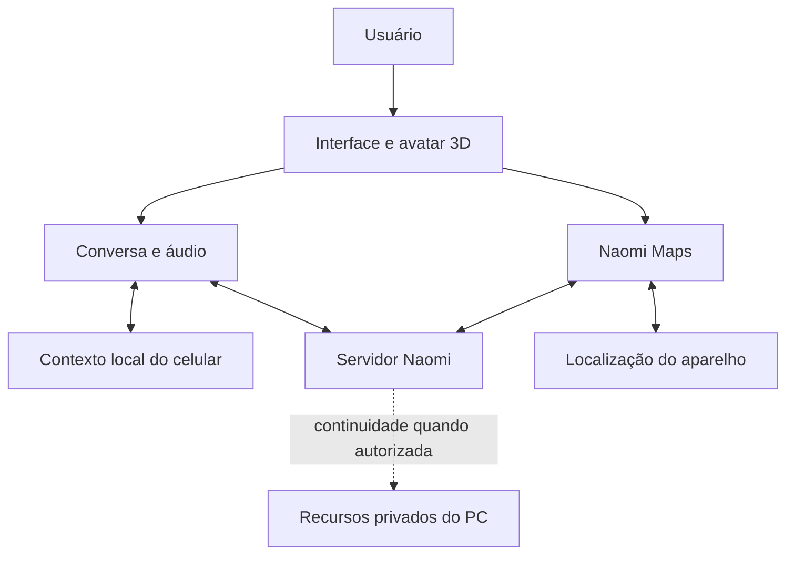

# Naomi Mobile 3D

[Início](../README.md) · [Arquitetura](arquitetura.md) · [Servidor](servidor.md) · [Cliente](cliente.md) · [Maps](naomi-maps.md)

O Naomi Mobile 3D leva a interação com a assistente para o **celular Android**, combinando conversa, áudio e uma presença visual em Unity. O avatar é a camada de apresentação; conversa, memória, conexão e recursos do aparelho têm responsabilidades próprias.

## Componentes da experiência

| Parte | Papel |
| --- | --- |
| Interface e cenas 3D | Apresentar a assistente, controles e estados da interação. |
| Cliente de conversa | Enviar texto ou áudio e apresentar a resposta do servidor. |
| Contexto local | Manter continuidade no aparelho e preparar o contexto permitido para uma solicitação. |
| Integração Android | Acessar recursos como microfone, localização e ciclo de vida do aplicativo. |
| Maps | Oferecer busca de destinos, mapa e navegação dentro da experiência mobile. |
| Continuidade com o PC | Acrescentar sincronização e recursos da ponte quando compatíveis e disponíveis. |

## Como se conecta

O celular conversa diretamente com o servidor. Nas implementações que enviam contexto local, a memória do aparelho participa da solicitação. Fluxos compatíveis também podem usar a ponte com o PC; se essa ponte estiver indisponível, ela não deve ser confundida com a disponibilidade do servidor de conversa.

## Três distinções importantes

**Contexto local não significa inferência local completa.** O aparelho pode guardar continuidade enquanto a resposta é produzida por um modelo no ambiente do servidor.

**Memória mobile não é automaticamente a memória semântica desktop.** Elas têm implementação e capacidade próprias. Sincronização é um recurso separado, condicionado à versão e ao acesso permitido.

**Independência do cliente desktop não significa independência de rede.** O PC pessoal não precisa executar o cliente para toda conversa mobile, mas o servidor utilizado precisa estar disponível. Quem hospeda o servidor nesse mesmo PC precisa mantê-lo ligado para essas funções.

## Unity e Android

A base técnica combina **Unity 6, C# e URP**, com pontes para recursos Android. A camada Unity organiza cenas e interação; os componentes Android integram capacidades que dependem do sistema operacional.

O mapa interativo tem renderização própria em WebView. Alternar entre sala 3D, conversa e Maps exige atenção ao consumo de memória, ao uso de áudio e ao retorno do aplicativo após suspensão. Esses cuidados fazem parte do trabalho de integração e desempenho.

## Estado e limites

O foco documentado é Android em desenvolvimento ativo. Esta página não anuncia uma versão iOS, disponibilidade em lojas ou funcionamento integral sem internet.

Recursos do aparelho dependem de permissões e condições do sistema. Qualidade visual, tempo de resposta e comportamento em segundo plano precisam de validação no dispositivo e na versão distribuída. Assets de avatar, cenas privadas, credenciais e APKs não são publicados nesta vitrine.

Para entender a parte de navegação, continue em [Naomi Maps](naomi-maps.md).
