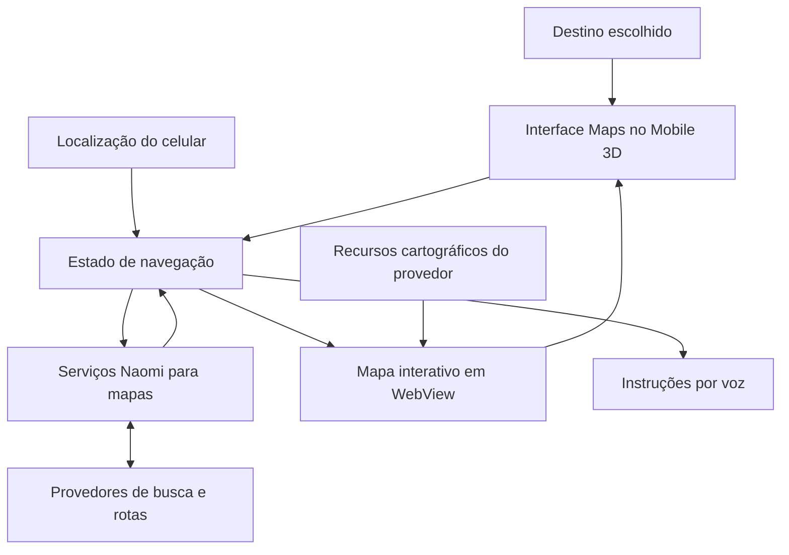

# Naomi Maps

[Início](../README.md) · [Arquitetura](arquitetura.md) · [Servidor](servidor.md) · [Cliente](cliente.md) · [Mobile 3D](mobile-3d.md)

O Naomi Maps é a experiência de **mapas e navegação integrada ao Naomi Mobile 3D**. Seu papel é conectar localização, busca de destinos, rota, instruções e apresentação visual em uma interação coerente no celular.

O projeto combina engenharia própria de interface e integração com serviços cartográficos externos. Não implica possuir uma base cartográfica própria nem substituir os provedores de mapas.

## Quatro responsabilidades distintas

| Camada | O que faz |
| --- | --- |
| Localização | Obtém a posição do aparelho e considera a qualidade das atualizações de GPS. |
| Mapa | Desenha a região, o marcador, a rota e as camadas visuais disponíveis. |
| Navegação | Coordena destino, progresso, manobras, recálculo e instruções por voz. |
| Serviços | Fornecem busca, rotas e informações de trânsito, conforme configuração e cobertura. |

Um mapa aparecer na tela não significa que uma rota esteja ativa. Receber GPS não significa que a posição tenha precisão suficiente. Dados de trânsito ausentes também não significam trânsito livre.

## Arquitetura conceitual

Na base Android inspecionada, o caminho interativo preferido usa **Mapbox GL JS em Android WebView**, conectado à camada Unity. O GPS e o estado de navegação alimentam o mapa. A cena 3D e o mapa têm ciclos de renderização diferentes.

Esse diagrama explica responsabilidades; não divulga contratos de integração, URLs operacionais ou configuração dos provedores. Também não afirma que todos os APKs distribuídos usam exatamente a mesma revisão.

## Percurso de uso

1. O aplicativo obtém acesso à localização e acompanha a qualidade do sinal.
2. A pessoa busca um lugar e escolhe o destino.
3. Os serviços de rota retornam o percurso e as informações disponíveis.
4. O celular apresenta a rota e acompanha o avanço usando a localização.
5. A navegação coordena as próximas instruções e atualizações compatíveis com o estado atual.
6. Ao encerrar o mapa ou suspender o app, os componentes precisam gerenciar recursos e continuidade.

O acompanhamento da rota não depende de pedir ao modelo de linguagem que decida cada movimento. Conversa e navegação têm responsabilidades próprias, inclusive na coordenação de áudio.

## Capacidades e limites

| Capacidade presente na base de desenvolvimento | Dependência ou limite |
| --- | --- |
| Busca de destinos e lugares | Serviço configurado, conectividade e cobertura. |
| Mapa interativo com acompanhamento de posição | GPS, permissões, recursos cartográficos e suporte gráfico do aparelho. |
| Rotas, manobras e progresso | Dados retornados pelo serviço e qualidade da localização. |
| Instruções por voz | Caminho de áudio disponível e coordenação com outras falas. |
| Trânsito, ocorrências e interdições | Disponibilidade, atualização e cobertura dos dados; a apresentação varia por versão. |
| Recálculo e atualização de navegação | Estado da rota, rede e respostas válidas do serviço. |

Há componentes para representar alternativas e informações adicionais de rota. A presença de dados no servidor não significa que toda versão mobile já apresente todas essas informações na interface.

## Desafios de engenharia

- **GPS instável:** evitar que oscilações pareçam deslocamento real ou provoquem mudanças desnecessárias.
- **Resultados fora de ordem:** impedir que uma busca ou rota antiga substitua o destino atual.
- **Ciclo de vida:** tratar abertura, fechamento, suspensão e recuperação do mapa.
- **Desempenho:** equilibrar WebView, cena Unity, memória, bateria e aquecimento.
- **Clareza visual:** distinguir rota, posição, trânsito e alertas sem esconder informação útil.
- **Áudio:** coordenar instruções de navegação com a conversa da assistente.

Esses pontos orientam o desenvolvimento e a validação. Não constituem certificação de precisão, cobertura universal de trânsito ou navegação totalmente offline.

## Privacidade e publicação

Localização, destinos e trajetos podem conter dados pessoais. Este portfólio não publica coordenadas reais, histórico de deslocamento, capturas com locais privados ou credenciais de serviços cartográficos.

O Maps continua em evolução dentro do [Mobile 3D](mobile-3d.md). Leia o [roadmap público](roadmap.md) para os focos de qualidade, sem cronogramas ou promessas de lançamento.
