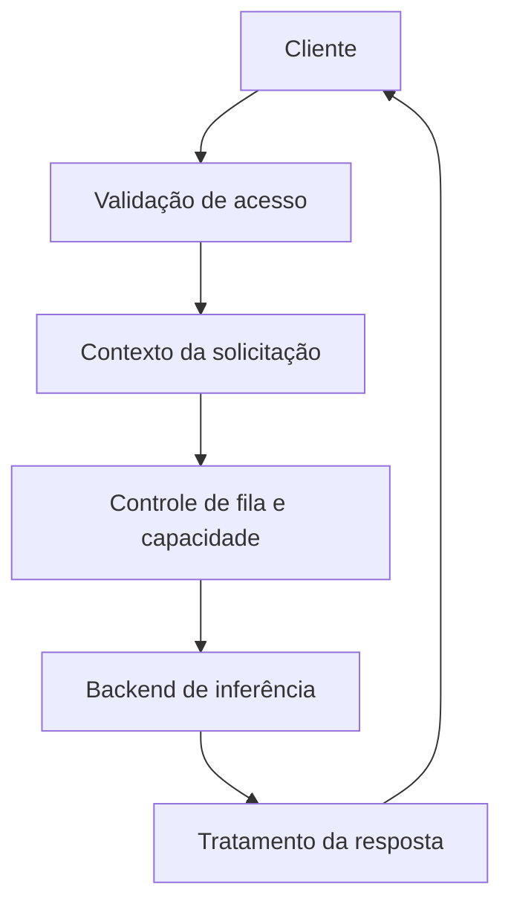

# Naomi Servidor

[Início](../README.md) · [Arquitetura](arquitetura.md) · [Cliente](cliente.md) · [Mobile 3D](mobile-3d.md) · [Maps](naomi-maps.md)

O servidor é a camada que **recebe pedidos dos clientes e coordena o processamento das respostas**. Ele reúne contexto permitido, acesso aos modelos e serviços compartilhados, enquanto cada cliente cuida de sua experiência local.

## Responsabilidades

| Área | Papel do servidor |
| --- | --- |
| Conversa | Preparar o contexto de uma interação e coordenar a geração de resposta. |
| Modelos | Encaminhar solicitações ao backend configurado, incluindo modelos locais via Ollama. |
| Concorrência | Organizar fila, capacidade de inferência, espera e cancelamento. |
| Comunicação | Entregar resultados por HTTP e streaming SSE nos fluxos compatíveis. |
| Identidade | Trabalhar com os serviços de autenticação e o escopo da conta. |
| Mobile | Atender conversa, áudio e recursos compartilhados do aplicativo. |
| Maps | Intermediar consultas geográficas, rotas e dados de navegação conforme os provedores configurados. |

O servidor de conversa e os serviços de identidade têm responsabilidades distintas. Este guia não expõe como esses serviços são implantados ou protegidos em produção.

## Fluxo de uma solicitação

Esse desenho limita a competição por CPU, memória e GPU. Uma solicitação de conversa não precisa iniciar outro modelo pesado sem considerar a capacidade já ocupada. Consultas de Maps e outras operações especializadas têm fluxos próprios; não passam necessariamente pelo modelo de linguagem.

## Relação com os clientes

- **Desktop:** recebe solicitações de conversa e contexto autorizado; o PC mantém interface, áudio e integrações locais.
- **Mobile 3D:** atende o aplicativo diretamente. O celular pode fornecer seu próprio contexto, sem exigir que o desktop pessoal esteja conectado.
- **Maps:** fornece resultados de busca, rotas e informações disponíveis; o celular mantém GPS, interface e apresentação da navegação.

Um servidor alcançável continua sendo necessário para os recursos que dependem dele. Se o próprio usuário hospeda esse servidor no PC, desligar essa máquina interrompe tais recursos.

## Memória e privacidade

O servidor recebe o contexto necessário ao fluxo, que pode vir do cliente ou de uma ponte autorizada. Isso não equivale a publicar o banco de memória do dispositivo. Dados de conta, contexto de conversa e resultados do modelo devem permanecer separados entre sessões.

A memória do celular e a memória semântica desktop são componentes diferentes. A existência de sincronização não significa que todo histórico esteja sempre disponível em todos os canais.

## Engenharia e limites

Python e FastAPI sustentam a camada de serviço; HTTP/SSE e filas organizam a comunicação e o processamento. Disponibilidade de modelos, capacidade de hardware e provedores externos influenciam a latência e os recursos acessíveis.

Esta página documenta responsabilidades do servidor em desenvolvimento. Não publica código executável do backend, rotas de API, credenciais, regras comerciais, prompts ou configuração operacional. Os testes da demo pública não validam a instalação de um servidor real.
